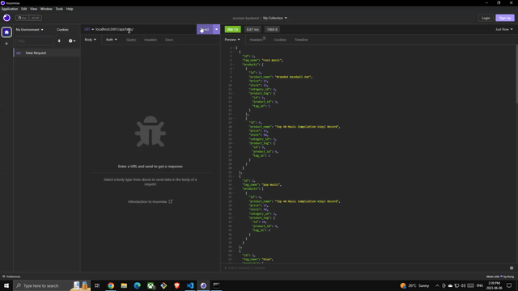
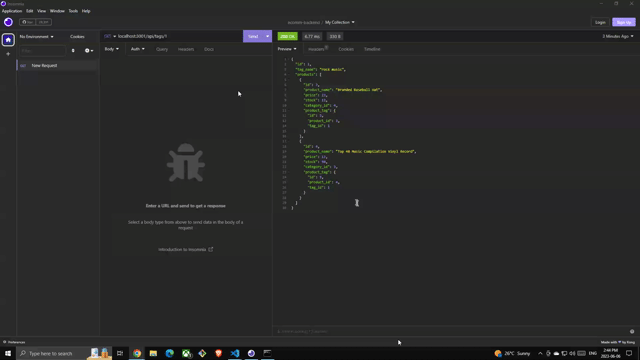

# Ecommerce Backend
   

## Description
Creating backend api routes for an eccomerce application. The app allows users to make GET, POST, PUT, and DELETE requests

## Table of Contents
1. [Installation](#installation)
2. [Usage](#usage)
3. [Contributions](#contributions)
4. [Tests](#tests)
5. [License](#license)
6. [Questions](#questions)

## Installation
NA

## Usage
Users will first run 'mysql -u root -p', enter their password and run 'source ./db/schema.sql'. Next, run 'node seeds/index.js' followed by 'npm start'. All of these steps are required to initialize the application.

## Contributions
NA

## Tests

Google drive link to DEMO for app inizialization: https://drive.google.com/file/d/1yZDGzjMt9d1AIHKmj1BJrPNr1ockVl1T/view 

Once the app is inizialized and running with npm start we can open insomnia to see the requests in action.

First, we have the GET requests for categories, products, and tags:

Google drive link to DEMO for GET requests https://drive.google.com/file/d/1NA_K3aoxg7IazfsL6Tm4BZ9akmxq8h4h/view

Next, is the GET requests to return a single category, product, and tag:

Google drive link to DEMO for single GET requests https://drive.google.com/file/d/19Z2Q1Vlb1tlxcHZBWY2HAYhZk4VvTFjS/view

Finally we have an example of a POST, PUT, and DELETE in the categories path.

Google drive link to DEMO https://drive.google.com/file/d/1K3z7D7cdgAwmM7fYxFyVZHaYcDdkNZkO/view

## License
This project is licensed under mit 
https://opensource.org/licenses/MIT

## Questions
If you have any additional questions regarding this project please contact me at maduraigurveer@gmail.com.
You can view more of my work at https://github.com/gurverm